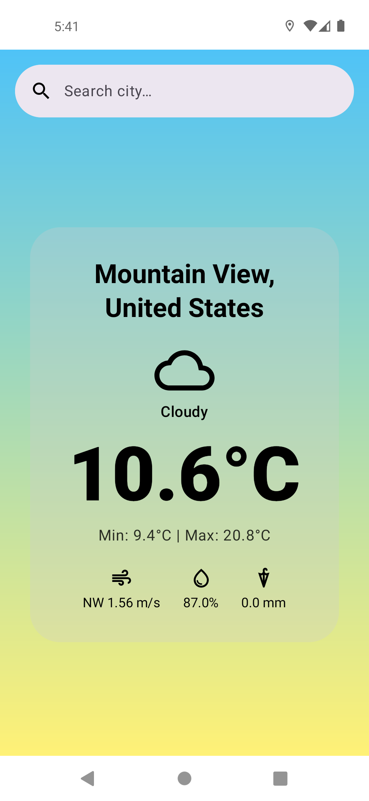
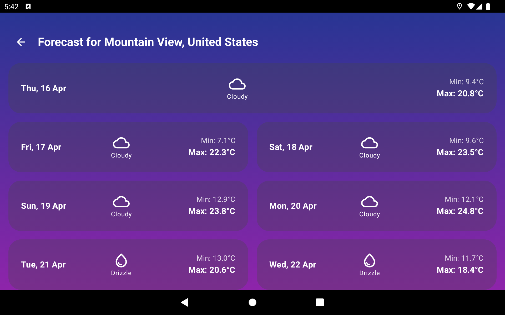

# WeatherVoyager 🌤️

A modern, responsive Android weather application built to demonstrate advanced Jetpack Compose UI techniques, Clean Architecture, and Unidirectional Data Flow (MVI). 

This project also serves as an R&D playground for **AI-Assisted Engineering (Prompt-Driven Development)**, showcasing how AI tools can accelerate structural generation and boilerplate delivery while maintaining strict human-led architectural oversight and zero compromises on code quality.

## 📱 Screenshots

  
  &nbsp;&nbsp;&nbsp;&nbsp;
  

## ✨ Key Features

* **Responsive & Adaptive UI:** Utilizes advanced Jetpack Compose layouts (`LazyVerticalGrid`, `GridItemSpan`) to seamlessly adapt the user interface across phones and tablets (landscape/portrait).
* **Unidirectional Data Flow:** Implemented strictly following the MVI (Model-View-Intent) pattern for predictable state management.
* **Offline-First Design:** Fault-tolerant architecture designed to handle poor network conditions gracefully.
* **Clean Architecture:** Strict separation of concerns across Presentation, Domain, and Data layers.

## 🛠 Tech Stack

* **Language:** Kotlin
* **UI Toolkit:** Jetpack Compose
* **Asynchronous Programming:** Coroutines & Flow
* **Dependency Injection:** Dagger / Hilt
* **Architecture:** Clean Architecture, MVI / MVVM
* **Networking:** Retrofit & OkHttp

## 🧠 AI-Assisted Engineering Approach

WeatherVoyager was developed utilizing **Prompt-Driven Development (PDD)**. AI tools were leveraged to accelerate UI prototyping and structural code generation. However, core architectural boundaries, state management, multithreading synchronization, and layout responsiveness (like the dynamic grid system for tablets) were strictly designed, reviewed, and controlled by human engineering expertise. 

## 📝 License

This project is licensed under the Apache License 2.0 - see the [LICENSE](LICENSE) file for details.
